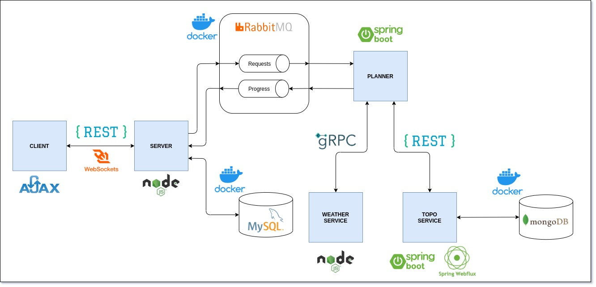

# Eolo Planner

## Architecture



## Deploying infrastructure

Is needed to run the platform the deployment of three containers (MySQL, RabbitMQ and MongoDB):

```
$ docker-compose up
```

If you wish to launch the containers in background, include ```-d```

The infrastructure is running in default ports with these connection details:

* MySQL:
  * user: ```root```
  * password: ```password```
  * database: ```eolo```
* RabbitMQ:
  * user: ```guest```
  * password: ```guest```

## Installing dependencies

```
$ node install.js
```

## Deploying the platform

```
$ node exec.js
```

## Author

[David Rojo(@david-rojo)](https://github.com/david-rojo)
